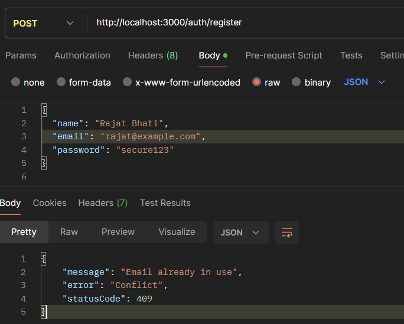
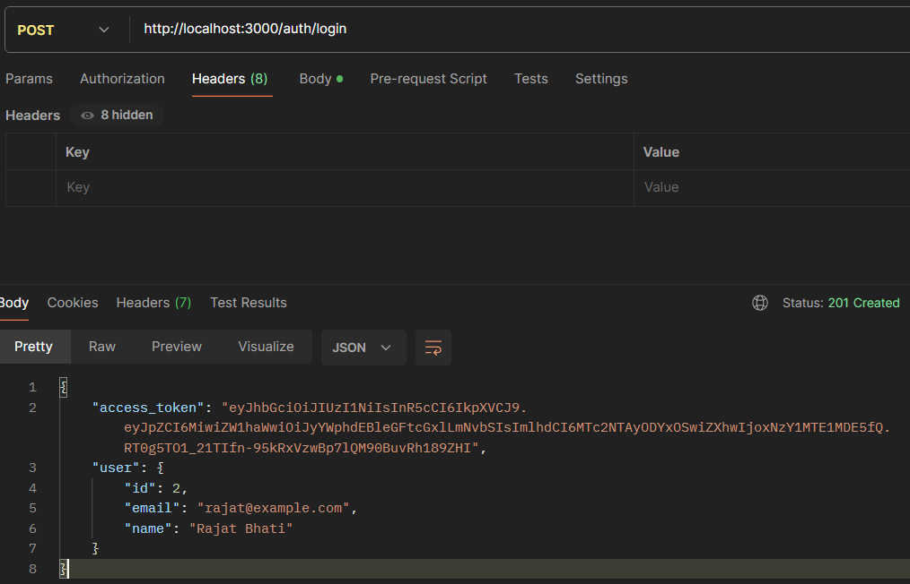
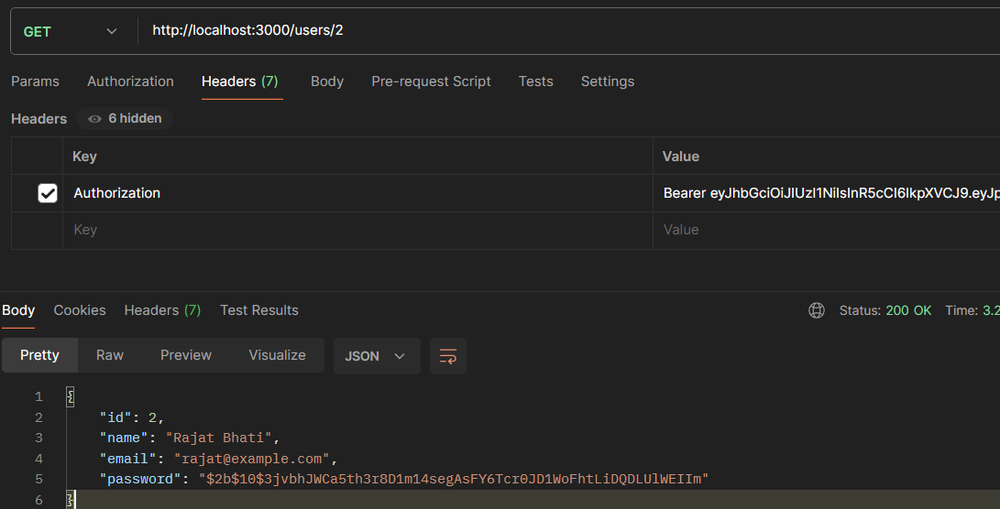
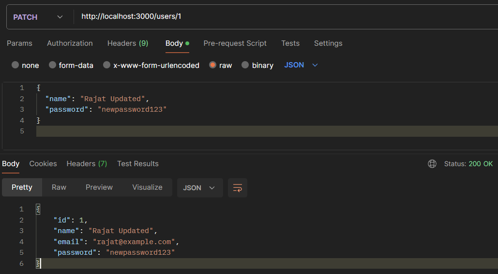
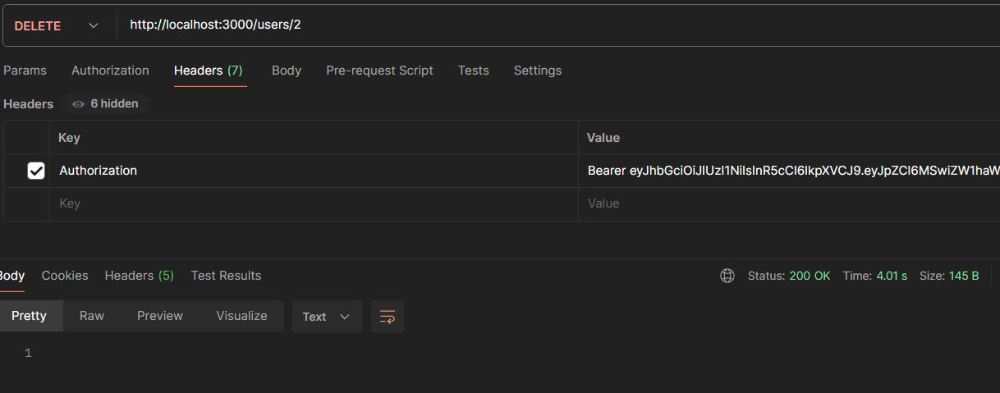

# NestJS Authentication & User Management API

A NestJS Authentication API with JWT-based login, signup, protected routes, unit & e2e tests, and a modular architecture.

## Features

- JWT Authentication (signup & login)
- User CRUD operations
- Protected routes using Passport-JWT
- Unit + E2E tests (Jest + Supertest)
- Environment variables support

## Project Structure

```
src/
 ├── auth/
 │    ├── auth.controller.ts
 │    ├── auth.service.ts
 │    ├── auth.module.ts
 │    ├── jwt.strategy.ts
 │
 ├── users/
 │    ├── users.controller.ts
 │    ├── users.service.ts
 │    ├── users.module.ts
 │    ├── dto/
 │    │    ├── create-user.dto.ts
 │    │    └── update-user.dto.ts
 │    └── entities/
 │          └── user.entity.ts
 ├── app.module.ts
 ├── main.ts

test/
 ├── app.e2e-spec.ts
 └── jest-e2e.json
```

## Installation

1. Clone

```
git clone https://github.com/Rajatt09/Nest.js-apis.git
cd Nest.js-apis
```

2. Install

```
npm install
```

3. Create `.env`

```
DATABASE_URL= your neon-tech-database-url
JWT_SECRET=your-secret-key
PORT=3000
```

## Run

- Development

```
npm run start:dev
```

## Endpoints

### Signup

POST /auth/register
Body:

```json
{
  "name": "Rajat Bhati",
  "email": "rajat@gmail.com",
  "password": "123456"
}
```

### Login

POST /auth/login
Body:

```json
{
  "email": "rajat@gmail.com",
  "password": "123456"
}
```

Response:

```json
{
  "access_token": "JWT-TOKEN-HERE"
}
```

### Protected Route

GET /users
Requires header:

```
Authorization: Bearer <token>
```

## JWT Strategy

- Uses Passport-JWT
- Token extraction: ExtractJwt.fromAuthHeaderAsBearerToken()
- Validates token and injects user into request

## Testing

- Run all tests:

```
npm run test
```


- Test coverage:

```
npm run test:cov
```

- E2E tests:

```
npm run test:e2e
```

## API Test URLs

- Signup: POST http://localhost:3000/auth/register

  

- Login: POST http://localhost:3000/auth/login

  

- [ Protected Routes ]

1. Fetch User:

GET http://localhost:3000/users

GET http://localhost:3000/users/:id [for fetching details for specific user with user id]

Requires header: `Authorization: Bearer <token>`



2. Update User: PUT http://localhost:3000/users/:id

Requires header: `Authorization: Bearer <token>`



3. Delete User

DELETE http://localhost:3000/users/:id

Requires header: `Authorization: Bearer <token>`


